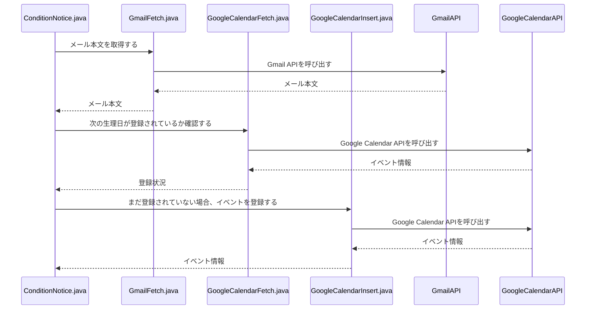

# 概要

Gmailより取得した特定の日付のイベントをGoogle Calendarに登録するバッチ
毎日1時に実行される

## 簡単な説明
このアプリケーションは、Gmailから特定のメールを取得し、そのメールの本文から次回の生理予定日を抽出します。抽出した日付はGoogleカレンダーに登録され、ユーザーが生理予定日を忘れることなく管理できるようになります。

4moonから送信されたメールを使用して、 gmail APIより、最新のメールを取得する

1. メールに記述されている本文より予定の日付を取得する

2. 取得した日付に特定の予定がすでに登録されている場合、終了

3. 取得した日付に特定の予定がすでに登録されていない場合、その日付に登録処理を行う

## 機能

- Gmail APIよりメール本文取得
- Google Calendar APIより予定の取得
- Google Calendar APIより予定の登録

## 必要要件

- Java17
- 環境変数
  - GMAIL_LABEL_ID：取得する対象メールのラベルID
  - GOOGLE_CALENDAR_ID：予定を登録するユーザID
- client_secret.jsonを直下に作成する
  - 下記を参考にgoogle cloudでGmail、Google CalendarのOAuth認証を行う必要あり
  - https://qiita.com/ho-rai/items/df82e4fb2e46217e6f4e
- credentialsフォルダに認証情報が格納されます（作る必要あるかも）
  
## 参考

https://qiita.com/hsn/items/5779fc8b41d4aecaeb83

https://qiita.com/ho-rai/items/df82e4fb2e46217e6f4e

https://think-simple-enjoy-life.com/599

